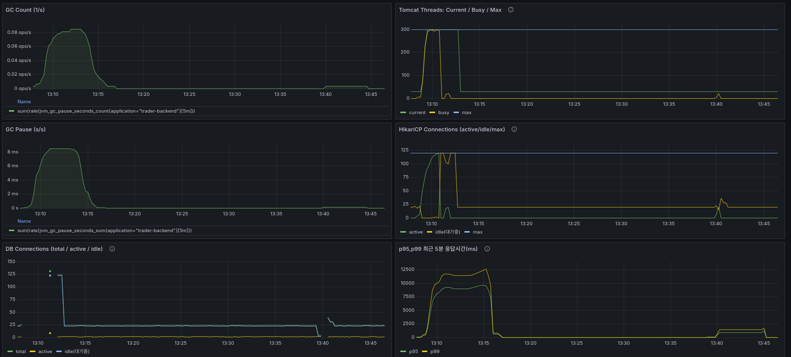

# 배포서버 부하 테스트 구축 보고서

**시행일자:** 2025-10-17  
**테스트 목적:** 배포 서버 환경에서 k6 부하 테스트를 통한 응답 지연(p95) 원인 분석 및 임계점 탐색

---

## 1. 서버 환경

| 항목    | 사양                       |
| ------- | -------------------------- |
| 모델    | FIREBAT                    |
| CPU     | 4 Core                     |
| RAM     | 4 GB                       |
| Storage | 512 GB SSD                 |
| OS      | Ubuntu 24.04 (Docker 기반) |

---

## 2. 시스템 구성

**배포 프로세스**

- Java Spring Boot 애플리케이션을 빌드하여 Docker Hub에 이미지로 Push
- 배포 서버에서 `docker-compose.yml` 기반으로 Pull 및 실행

**서비스 구성 컨테이너**

1. Java / Tomcat / Spring
2. PostgreSQL (Timescale Extension)
3. Prometheus + Grafana + Exporters
   - postgres-exporter
   - node-exporter (호스트/컨테이너 메트릭)
   - cAdvisor (컨테이너별 CPU/메모리)

---

## 3. Grafana Dashboard 구성

### 3.1 Application (Spring)

- RPS
- Error Rate
- P95 / P99 Latency
- JVM Heap Usage (%)
- Tomcat Thread (Busy / Current / Max)
- HikariCP (Active / Idle / Max)
- GC Pause Count / Time

### 3.2 Container (cAdvisor)

- Container CPU Usage
- Container Memory Usage
- Container Filesystem Usage

### 3.3 Database (Postgres Exporter)

- Cache Hit Ratio
- Deadlocks
- TPS (Transactions per Second)
- Active / Idle / Total Connections

### 3.4 Node (Node Exporter)

- CPU Usage
- CPU IO Wait
- Memory Usage
- Filesystem Usage
- Disk IO Time

### 3.5 Overview

- 주요 Application / Container / Node 지표를 종합 모니터링

---

## 4. 네트워크 환경

- 테스트 클라이언트: 노트북 (8Core / 64GB RAM)
- 서버: FIREBAT (4Core / 4GB)
- 연결: CAT6 LAN 케이블 직접 연결 (유선)
- 왕복 지연 시간: 평균 **0.7 ms** — 네트워크 영향 미미

---

## 5. 문제점 요약

- 동일한 Docker 이미지 및 설정 환경에서 **노트북과 서버 간 p95 응답속도 차이 약 7~10배**
- 네트워크 지연은 무시 가능한 수준임(avg:~2ms)
- ***

## 6. 1차 원인 가설

1. **서버 사양 한계로 인한 CPU 및 Thread 포화**
   - 대부분의 스레드가 DB I/O 대기로 묶이며 큐잉 발생
2. **Docker CPU / Memory 제한**
   - Compose 설정에서 `cpus`, `mem_limit` 혹은 `deploy.resources.limits` 존재 가능
3. **PostgreSQL (Timescale) I/O 지연**
   - HDD 또는 low IOPS 환경에서 read latency 증가

---

## 7. 원인 해결 시나리오 및 개선

1. 서버 사양 비교
   - 비교적 가벼운 테스트로도 서버의 CPU 100% 사용
   - 같은 매트릭으로 노트북의 경우 9.32%
   - CPU,Disk,Memory 사용률은 각 노드마다 비율은 비슷함
   - 결론 : 서버 사양으로 인한 문제는 아니라고 판단
2. Docker CPU / Memory 제한
   - 같은 도커 설정으로 실행
   - 직접 서버의 컨테이너 메모리 제한 확인 결과 제한 없음
   - 결론 : 컨테이너 자원 제한으로 인한 문제는 아니라고 판단
3. DB지연
   - 애플리케이션 Error Rate 증가
   - HikariCP Connections active 폭등하여 Max에 막힘, Idle 0 -> 풀이 꽉 차서 병목 발행
   - 동시에 GC count/second 급등
   - Tomcat Thread의 current,busy 급등하여 Max에 막힘
   - 결론 : DB포화로 진단

| 파라미터                   | 역할                                                                                                                                                                                                                                                                                                                                                                                                      | 영향 영역                           |
| -------------------------- | --------------------------------------------------------------------------------------------------------------------------------------------------------------------------------------------------------------------------------------------------------------------------------------------------------------------------------------------------------------------------------------------------------- | ----------------------------------- |
| `shared_buffers`           | PostgreSQL 내부의 **데이터 페이지 캐시 영역** (DB 자체 버퍼 풀), 자주 읽히는 데이터 페이지를 디스크 대신에 메모리에서 처리                                                                                                                                                                                                                                                                                | 디스크 I/O, 캐시 히트율             |
| `effective_cache_size`     | 플래너가 **OS 페이지 캐시**까지 고려해 최적 실행계획을 선택하도록 하는 힌트값, shared_buffers보다 훨씬 큰 값을 줘야 함, Postgresql의 캐싱 구조는 디스크 -> OS페이지 캐시 -> postgreSql shared_buffers 이 두단계를 거치기에 실제 메모리에 머무는 캐싱 데이터 총향은 OS캐시 + postgresql 캐시를 합친 값 즉 OS가 실제로 캐시하고 있는 메모리까지 포함한 전체 캐시 용량을 추정하도록 힌트를 주기 위함이다. | 쿼리 플랜, 인덱스/조인 전략         |
| `work_mem`                 | 각 쿼리 노드가 **정렬·해시 조인·집계 시 사용하는 메모리 한도**  이 값이 작을수록 중간 데이터를 메모리가 아닌 디스크의 임시파일로 보내어 처리할 확률이 늘어나며 쿼리 속도의 저하 발생                                                                                                                                                                                                                   | 쿼리 연산 속도, 임시파일 발생률     |
| `maintenance_work_mem`     | VACUUM/CREATE INDEX 시의 메모리 버퍼 크기                                                                                                                                                                                                                                                                                                                                                                 | 백그라운드 유지보수 I/O 효율        |
| `max_connections`          | 동시 세션 수 제한 (1:1 프로세스 모델 기반)                                                                                                                                                                                                                                                                                                                                                                | 커넥션 풀, 컨텍스트 스위칭 오버헤드 |
| `shared_preload_libraries` | TimescaleDB, pg_stat_statements 등 확장 로딩                                                                                                                                                                                                                                                                                                                                                              | 모니터링·하이퍼테이블 지원          |

### 8.해결방법

- DB포화로 진단하였기 때문에 Postgres설정 변경
- 커넥션 150개 -> 이전에도 매트릭에 130언저리여서 큰 체감없음
- 버퍼 1GB + 캐쉬 사이즈 3GB -> 매모리 캐시가 커져 디스크I/O감소, 같은 쿼리여도 성능 향상 -> 커넥션 점유시간 하락
- work_mem=16MB -> 정렬/해시 조인/집계가 메모리 내에서 끝나서 임시 파일 크게 줄임 -> 쿼리 속도 향상
- effective_cache_size 향상으로 인덱스/조인 전략 선택이 좋아져 쿼리 성능 향상

### 9.결론

- work_mem,effective_cache_size,buffer 설정을 변경해가면서 테스트 경과 work_mem, effective_cache_size는 성능 소폭 상향
- 주된 해결책 : buffer size 상향 -> 에러율 0, GC count 0.0847ops/s -> 0.00339ops/s 25배 줄임
- Tomcat 쓰레드 정상화, HikariCP 커넥션 정상화

- before:1시10분경, after:1시40분경

## 10. 향후 계획 (요약)

| 단계 | 목표           | 주요 작업                                             |
| ---- | -------------- | ----------------------------------------------------- |
| 1차  | 임계점 탐색    | constant-arrival-rate RPS 스윕 테스트로 한계 RPS 측정 |
| 2차  | 임계 근방 튜닝 | CPU/GC/DB 쿼리 등 병목별 성능 개선 및 비교 문서화     |

---

## 11. 추가 설정 변경 10-29

#### 문제 발견
- 안정 임계값 테스트 중 p95=5.7s 수준의 고지연 지속

- DB 활성 커넥션 = 100% 포화

- 5xx 에러 증가

#### 원인 가설
1. DB 처리율 초과 트래픽 유입
2. 커넥션 과다 동시성(Hikari > DB 처리능력) → 락/IO 경합 확대
#### 해결방법
- K6 Step time: 30s → 90s (steady-state 확보)
- Hikari 최대 풀: 150 → 80 (DB의 ~80% 이하로 제한)
- connection-timeout: 2s → 5s (불필요 타임아웃/재시도 감소)

### 효과 (전/후)

| 지표 | 변경 전 | 변경 후 | 비고 |
|------|----------|----------|------|
| p95 | ~7000 ms → 5000 ms | ~2000 ms | 대기를 앱 레이어로 이동 |
| DB 활성 커넥션/Max | 100 % | ~56 % | 포화 해소 |
| 오류율 | 5xx 발생 | 0 % | 안정화 |
| RPS | ~60 | ~80 | 처리량 ↑ |

### 결론
풀 축소로 동시 DB 작업 수를 줄여 락/IO 경합을 해소했고, 쿼리 체류시간↓ → p95/p99↓, DB 포화↓, RPS↑.
