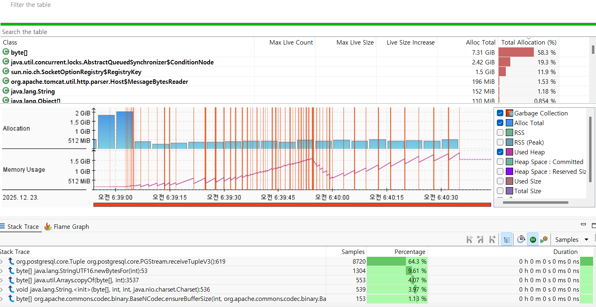
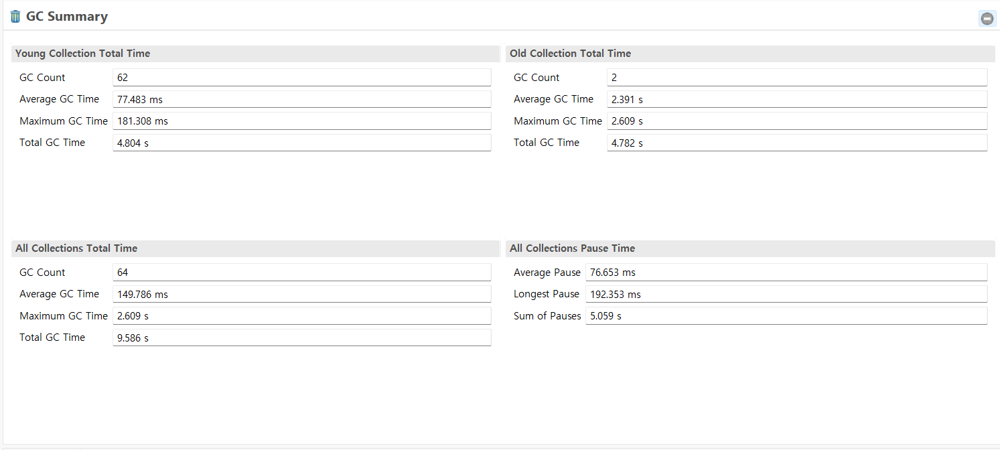
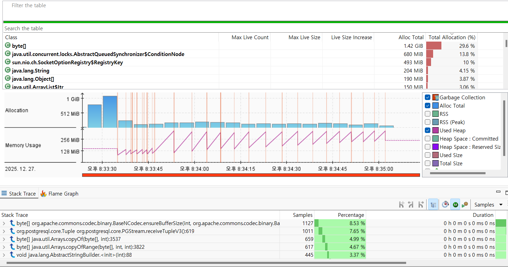
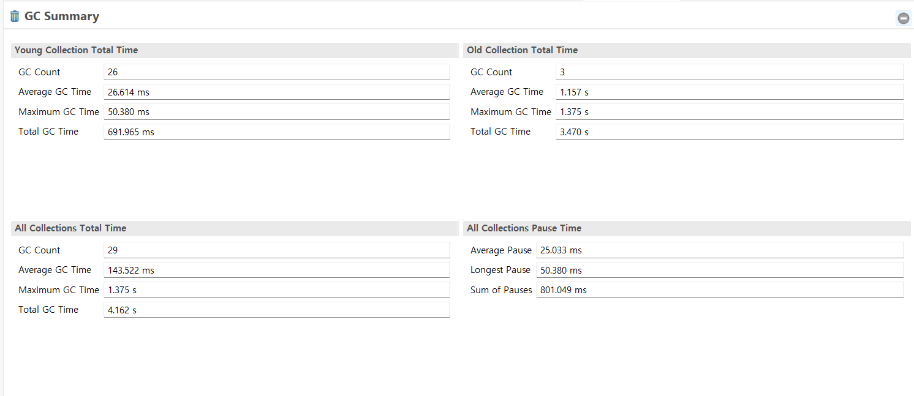
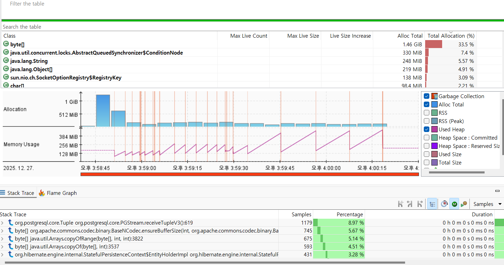
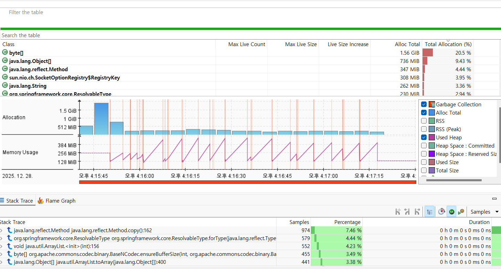
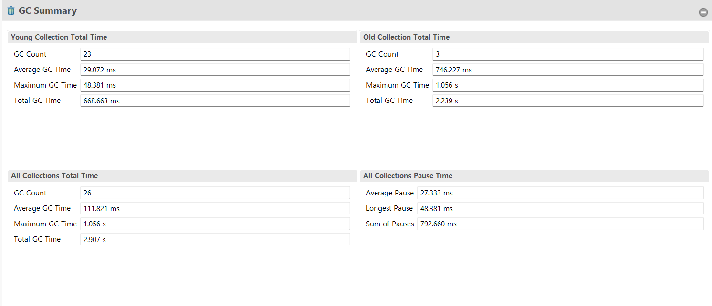

## 테스트 환경

| 항목                 | 설정                                                                                                       |
| -------------------- | ---------------------------------------------------------------------------------------------------------- |
| 서버 사양            | 4 Core / 16GB / SSD                                                                                        |
| DB                   | PostgreSQL 17 + TimescaleDB                                                                                |
| 커넥션 풀            | HikariCP max=150,idle=80                                                                                   |
| 테스트 도구          | k6 v0.52                                                                                                   |
| 초기 부하 유형       | EdgeController와 비슷한 RPS를 상정하였을때 매우 큰 과부하 -> 요청량 >= 10000에 맞춰서 120RPS \* 90s로 진행 |
| 네트워크             | 내부 브릿지 (Docker Compose 환경)                                                                          |
| 고정 테스트 부하,RPS | 웜캐시로 진행 30RPS 2m -> 메인 테스트 120RPS 90s 시드값 777로 고정,메인 테스트만 포함하여 측정             |
| GC 지표 정의         | 본부하 구간만 산정, JMC내의 GC Summary로 분석                                                              |
| JVM                  | OpenJDK Temurin 17 (64bit,JDK)                                                                             |
| GC 종류              | G1GC (Garbage-First)                                                                                       |
| 힙 초기/최대 크기    | Xms=248MB / Xmx=3942MB (컨테이너 자동 설정)                                                                |
| Heap Region Size     | 2MB                                                                                                        |
| Parallel Workers     | 4                                                                                                          |
| Max Pause Target     | 200ms (기본값, G1 MaxGCPauseMillis)                                                                        |
| String Deduplication | **Disabled** (명시 옵션 미사용)                                                                            |

---

# 지난 테스트 review

- 지난 테스트에서는 NodeController API의 성능을 개선하기 위해 데이터 조회와 관련된 여러가지 방법을 테스트하여 fetchjoin을 사용하기로 결정했다.
- 10K, 20자 preview반환으로 나누어 성능을 테스트 하였고 preview반환의 성능이 압도적으로 높은 것을 확인 할 수 있었다.
- 본 문서의 주제인 Allocation 기반 성능 분석 및 튜닝에 앞서 10K의 병목을 확실히 하고자 JMC를 통해 분석하였다.

## 테스트 부하 및 JMC 분석 이미지

| 항목                | 내용                                                      |
| ------------------- | --------------------------------------------------------- |
| 웝업 부하           | 8RPS + 2m                                                 |
| 본부하              | 20RPS + 90s                                               |
| 측정방식            | 웝업이 종료되고 jfr을 이용해 구간 기록 후 jmc를 통한 분석 |
| P95                 | 11257.29ms (15RPS 테스트에서 2271.19ms)                   |
| throughtput(본부하) | 20.00req/s                                                |
| ErrorRate           | 0.00%                                                     |

- jfr를 통해 기록할 경우 이전 문서와 동일한 RPS로 측정불가하여 P95가 급격히 뛰는 구간을 측정하였다.




- 위 이미지를 보면 상당히 높은 MemoryAllocation과 상위 스택 트레이스에 PGStream.receiveTupleV3()가 높은 비중을 차지하는 것을 알 수 있다.
- GC Summary이미지를 보면 총GC시간은 9.59s, 총 멈춘 시간은 5.06s으로 90초 본부하 테스트 동안 높은 시간 비중을 차지하는 것을 알 수 있다.
- 위 두 이미지를 분석한 결과 DB → JDBC → String 디코딩 과정에서 대용량 byte[] + char[]가 폭발적으로 생성하는 것을 알 수 있다.




- 다음 두 이미지는 10k -> 20자로 줄여 DB에서 조회하는 흐름의 경우이다.
- 테스트는 RPS를 20(웜업)->60(본부하)로 변경한 것 외에는 동일하다.
- 위 두 사진과 10k의 이미지를 보면 MemoryAllocation 및 GC의 압박이 확 낮아진 것(GC는 1/2배, Allocation은 5배가량)을 확인 할 수 있으며 대용량 컨텐츠의 목록 반환에서 데이터 양을 줄여 애플리케이션의 압박을 줄이는 것이 상당히 중요한 것을 알게되었다.

---

# JMC를 활용하게된 주요 문제 배경

노드 목록 조회 API에서 RPS 증가 시 p95 지연이 급격히 상승하는 문제가 발생하였다.
기존에는 JPA fetch 전략(fetch join, batch fetch 등)을 변경하며 성능을 개선했으나,
어느 시점 이후 어디를 더 바꿔야 하는지 명확히 보이지 않는 한계에 도달하였다.

이에 단순 쿼리 튜닝을 넘어, JFR + JMC 기반의 런타임 분석을 도입하여
병목의 실제 위치를 메모리,GC,스택 트레이스 관점에서 확인하고자 했다.

---

# 분석 접근 방법

- 부하 테스트(k6)

  - constant-arrival-rate 기반 본부하

  - p95 latency, throughput(active) 중심 평가

- JFR / JMC 분석

  - Top Allocating Classes

  - Top Stack Trace

  - GC Summary (Young / Old / All / Pause)

- 동일 RPS·동일 환경에서 구조별 비교

  - V1: 기존 구조(20자 preview + fetch join)

  - V2: fetch join 유지 + hotpath 개선

  - 2step: 조회 분리(2-step) 방식

---

## 주요 발견 사항

1. V1 → V2: Hotpath 개선 효과

- JWT 검증 로직이 필터/프로바이더에서 중복 실행되고 있음을 JMC Stack Trace로 발견

- 중복 제거 후:

  - BaseNCodec.ensureBufferSize 호출 수 감소

  - AbstractQueuedSynchronizer$ConditionNode 할당 감소

  - Old GC Total Time 감소

📉 Old GC Total

- V1: 3.47s

- V2: 2.22s (약 36% 감소)

→ 핫패스 개선만으로 메모리 안정성과 성능이 동시에 개선됨

2. V2 → 2step: 병목 이동과 GC 악화

- 2step 구조에서는:

  - PGStream.receiveTupleV3, ensureBufferSize 비중 감소

  - DB/JDBC 수신 병목은 완화됨

- 그러나 JMC 상위 할당/스택 트레이스에:
  - Method, ResolvableType, Object[], ArrayList 등 객체 그래프 조립 비용이 새 병목으로 등장

---

“초기 구현에서는 인증 단계에서 사용자 컨텍스트 구성을 위해 DB 조회가 포함되어 있었다.”

“부하가 증가함에 따라 인증 경로의 고정 비용이 누적되어 tail latency/throughput 안정성에 영향을 주었다.”

“JMC Allocation/Stack Trace를 통해 인증 경로가 공통 hot path임을 확인했고, 무상태 인증으로 재설계했다.”

V2 : hotpath개선 + fetchjoin그대로 사용 -> memoryallocation 감소
V1 : hotpath 개선전
2step : 노드 서비스 개선(노드만 가져오고 링크 테이블 다시 가져오기) -> PGStream.receiveTupleV3감소

# V1->V2

## JMC이미지


## V1의 분석 및 문제점, 해결방안

- 상위 Allocation에서 주요하게 보이는 것은 byte[], ConditionNode이다
  - byte[]:
  - ConditionNode:
- 상위 StackTrace에서 주요하게 보이는 것은 다음과 같다
  - ensureBufferSize():
  - PGStream.receiveTupleV3:
- 따라서 우선적으로 ensureBufferSize()를 줄이기 위해 라이브러리를 조회하였고 JWT관련 코드에서 decode(), encode()에서 주요하게 사용되는 것을 확인하였고 특히 decode()부분의 메서스 실행량이 특히 많은 것을 알 수 있다.
- 코드 분석 결과 JwtProvider클래스에서 사용중인 jwt토큰을 검증하는 부분에서 중복이 발생함을 알 수 있었다.
- 검증하는 메서드는 `com.auth0.jwt.JWT;` 해당 라이브러리를 사용하며
  1. JWTDecoder() 내부의 Base64.decodeBase64() 메서드를 사용하며
  2. Base64.decodeBase64()에서 `return new Base64().decode(base64String);`를 사용하고
  3. 최종적으로 BaseNCodec.decode()를 사용함을 알 수 있다.
- 이는 JFR분석을 통해 알 수 있듯이 주요 탑 스택트레이스인 ensureBufferSize()의 BaseNCodec.decode() 원인이 아래에 후술할 jwt토큰 검증에 있다는 것을 알 수 있었으며 이를 중점적으로 개선하였다.

```java
//기존코드

@Component
public class JwtFilter extends OncePerRequestFilter {
  ...
        String token = jwtTokenProvider.resolveToken(request);
        // 토큰이 존재하고 유효하면 사용자 정보를 SecurityContext에 설정 && 토큰유지기한이 유효한지 체크
        if (token != null && jwtTokenProvider.validateToken(token) != null) {
            // JWT에서 사용자 인증 정보를 가져옴
            Authentication authentication = jwtTokenProvider.getAuthentication(token, userDetailService);
            SecurityContextHolder.getContext().setAuthentication(authentication);
        } else {
            //토큰이 없거나 유지기한이 유효하지 않을떄
            // TODO:리프레쉬 토큰 확인하고 안되면 따로 처리해주기 예를들어 에러응답을 반환하거나 401?
            handleInvalidToken(response, "accessToken인증오류");
        }
  ...
}


public class JwtTokenProvider {
...
    public String getTokenInfo(String receivedToken) throws UnsupportedEncodingException {
        //비밀키를 받아서 알고리즘으로 복호화, 만약 전달받은 토큰이 알고리즘과 비밀키가 일치하지 않으면 예외반환하고
        //만약 일치하면 복호화한 유저ID반환
        //만료시간 비교하고 만약 만료되었으면 리프레쉬 토큰을 확인하고
        DecodedJWT decodedJWT = validateToken(receivedToken);
        if(decodedJWT.getSubject() != null){
            if(new Date(System.currentTimeMillis()).before(decodedJWT.getExpiresAt())) {//토큰만료시간 이전이냐
                return decodedJWT.getSubject();
            }else{
              ...
            }

    public DecodedJWT validateToken(String receivedToken) {
        try {
            DecodedJWT verify = JWT.require(Algorithm.HMAC256(secret))
                    .build().verify(receivedToken);
            if(new Date(System.currentTimeMillis()).before(verify.getExpiresAt())) {//토큰만료시간 이전이냐
                return verify;
            }
            ...
        }

  public Authentication getAuthentication(String token, UserDetailsService userDetailsService) throws UnsupportedEncodingException {
        String userId = getTokenInfo(token);//유저아이디 받아아서 로그인 아이디로 변환
        Long id = Long.parseLong(userId);
        String loginId = userService.findUserByUserId(id).getLoginId();
        UserDetails userDetails = userDetailsService.loadUserByUsername(loginId);
        return new UsernamePasswordAuthenticationToken(userDetails, "", userDetails.getAuthorities());
  }

}
```

```java
//수정코드
@Component
public class JwtFilter extends OncePerRequestFilter {

        String token = jwtTokenProvider.resolveToken(request);
        if (token == null) {
            handleInvalidToken(response, "accessToken없음");
            return;
        }

        try {
            DecodedJWT jwt = jwtTokenProvider.validateTokenOrThrow(token); // 여기서 딱 1번 검증
            Authentication auth = jwtTokenProvider.getAuthentication(jwt, userDetailService);
            SecurityContextHolder.getContext().setAuthentication(auth);
            filterChain.doFilter(request, response);
        } catch (BaseException e) {
            handleInvalidToken(response, e.getStatus().getMessage()); // 네 방식대로 메시지 매핑
        }
        finally {
            // SecurityContext 초기화 (요청이 끝난 후)
            SecurityContextHolder.clearContext();
        }

    }

        private void handleInvalidToken(HttpServletResponse response, String message) throws IOException {
        response.setStatus(HttpStatus.UNAUTHORIZED.value());
        response.setContentType(MediaType.APPLICATION_JSON_VALUE);

        Map<String, Object> body = new HashMap<>();
        body.put("error", "Unauthorized");
        body.put("message", message);
        body.put("status", HttpStatus.UNAUTHORIZED.value());

        objectMapper.writeValue(response.getWriter(), body);
    }
}


@Service
public class JwtTokenProvider {

...
        public DecodedJWT validateTokenOrThrow(String token) {
        try {
            DecodedJWT jwt = JWT.require(Algorithm.HMAC256(secret))
                    .build()
                    .verify(token); // 여기서 서명/형식 검증

            Date exp = jwt.getExpiresAt();
            if (exp == null) {
                throw new BaseException(BaseResponseStatus.INVALID_JWT_TOKEN);
            }
            if (System.currentTimeMillis() > exp.getTime()) {
                throw new BaseException(BaseResponseStatus.ACCESS_TOKEN_EXPIRED);
            }
            return jwt;
        } catch (BaseException e) {
            throw e;
        } catch (Exception e) {
            log.error("JWT validation failed: {}", e.getMessage());
            throw new BaseException(BaseResponseStatus.INVALID_JWT_TOKEN);
        }
    }

    public Authentication getAuthentication(DecodedJWT jwt, UserDetailsService uds) throws UnsupportedEncodingException {
         String loginId = jwt.getSubject();
         UserDetails userDetails = uds.loadUserByUsername(loginId);
         return new UsernamePasswordAuthenticationToken(userDetails, "", userDetails.getAuthorities());
     }
}

```

#### 문제점 및 코드 수정 사항

1. **JWT 검증 로직 중복 실행 문제**

   기존 구조에서는 `JwtFilter`에서 `validateToken()`으로 한 번 검증한 뒤,
   이후 인증 객체를 생성하는 과정에서도 JWT를 다시 파싱하는 흐름이 섞여 있었다.
   그 결과 `JWT.require(...).build().verify(token)`이 **요청당 2회 실행될 수 있는 구조**였고,
   검증 비용 자체는 크지 않더라도 인증 경로가 길어지고 의도가 흐려지는 문제가 있었다.

2. **검증과 인증 책임이 섞인 구조**

   초기에는 `getAuthentication()` 내부에서 토큰 검증까지 처리하도록 설계했지만,
   필터 단계에서 토큰 존재 여부를 먼저 확인해야 했기 때문에
   결국 필터와 Provider 양쪽에서 검증 로직이 나뉘게 되었다.
   이로 인해 “어디에서 무엇을 책임지는지”가 코드만 봐서는 명확하지 않았다.

3. **검증 결과를 버리고 다시 계산하는 구조 개선**

   수정 후에는 `validateTokenOrThrow()`에서
   토큰 서명·형식·만료 여부를 한 번에 검증하고,
   검증이 끝난 `DecodedJWT` 객체를 그대로 인증 단계에서 재사용하도록 변경하였다.
   이를 통해 기존에 검증 결과를 버리고 다시 토큰을 해석하던 구조를 제거했다.

4. **불필요한 DB 조회 제거**

   기존 `getAuthentication()`에서는 토큰에서 userId를 추출한 뒤
   다시 DB를 조회해 loginId를 가져오는 흐름이 있었다.
   하지만 JWT에 이미 인증 주체를 식별할 수 있는 정보가 포함되어 있어,
   수정 후에는 토큰의 `subject` 값을 그대로 사용하도록 변경했다.
   이로 인해 인증 과정에서 발생하던 **요청당 불필요한 DB 조회를 제거**할 수 있었다.

5. **에러 원인 분리**

   이전에는 토큰 검증 실패 시 단순히 `null`을 반환해
   만료인지, 형식 오류인지 구분이 어려웠다.
   현재는 예외로 원인을 분리하여
   만료 토큰은 리프레시 대상으로,
   형식·서명 오류는 즉시 로그아웃 대상으로 처리할 수 있도록 개선했다.

#### 수정 전후 K6부하테스트 결과 및 JFR분석 결과

| Test Case          | Main RPS (active) | p95 Latency (ms) | Throughput (active req/s) |
| ------------------ | ----------------- | ---------------- | ------------------------- |
| **V1(중앙값)**     | **60**            | **7622.90**      | **59.61**                 |
| V1-re1             | 60                | 8488.78          | 59.27                     |
| V1-re2             | 60                | 7595.34          | 59.58                     |
| V2                 | 60                | 7027.21          | 59.82                     |
| **V2-re1(중앙값)** | **60**            | **6908.74**      | **59.91**                 |
| V2-re2             | 60                | 6460.37          | 59.90                     |

- 각각 3회 테스트 후 중앙값을 기준으로 분석하였고 P95지표의 대략 10% 성능 향상이 이루어졌으며 Throughput또한 각 3회 테스트에서 상승한 것을 알 수 있다.

#### V1,V2 JMC이미지 분석

- V1
  
- V2(HotPath개선)
  

- 두 이미지를 확인해보면 상단의 Top MemoryAllocate의 ConditionNode부분에서 360MB 줄었으며 이미지 하단의 Top StackTrace의 ensureBuffer()가 400회 정도 줄은 것을 알 수 있다.
- 두 항목은 직접적인 1:1 관계를 갖는 요소는 아니지만,
  요청 처리 경로에서 불필요한 작업과 병목이 함께 완화되었음을 보여주는 지표로 해석할 수 있다.

1. AbstractQueuedSynchronizer$ConditionNode

- AbstractQueuedSynchronizer: 자바 동시성에서 락과 대기열 구현체
- ConditionNode:Condition.await()로 잠들어 있는 스레드(대기자)를 연결 리스트로 관리하기 위해 만드는 노드
- ConditionNode가 많이 보이는 경우는
  1. 락 경쟁
  2. 리소스 부족(특히 DB커넥션/스레드풀) await으로 잠듬
  3. 큐잉으로 대기열 길어짐
- 현재 개선한 코드를 보면 2번 리소스 부족을 Jwt관련 코드내에서 DB조회기능을 없애면서 요청당 처리 시간이 단축되었고 동일 RPS내에서 동시에 처리중인 요청의 수가 줄어들면서 커넥션 풀 및 스레드 풀에서의 대기 상황이 완화되었을 가능성이 높다고 판단하였다.
- 이러한 변화가 JMC 상에서
  ConditionNode 할당량 감소(약 360MB)로 관측된 것으로 해석할 수 있다.

2. ensureBuffer()

- ensureBuffer:Base64같은 인코딩/디코딩 과정에서 버퍼 크기가 부족할때 발생하는 함수
- 다만 확인 결과 초기 버퍼 크기가 0이므로 크기가 부족해서 발생했다기 보다 검증->디코딩 과정에서 검증 부분이 딱 1번으로 줄어들어 ensureBuffer()또한 줄어들었다.
- ensureBuffer() 감소는
  메모리 할당 그래프에서는 크게 두드러지지 않았지만,
  Top Stack Trace 영역에서 명확한 감소가 관측되었으며
  JWT 처리 Hot Path가 정리되었음을 보여주는 보조 지표로 의미가 있다고 보았다.

### V1->V2결론

- JFR 및 JMC 분석을 통해, 코드 레벨에서는 인지하지 못했던
  동시성 대기 및 내부 처리 비용을 병목 후보로 식별할 수 있었다.
- WT 검증 중복 제거와 인증 과정의 DB 조회 제거를 통해
  공통 인증 경로에서 수행되던 불필요한 작업을 줄였으며,
  k6 부하 테스트와 JMC 분석 결과 이를 정량적으로 확인할 수 있었다.
- 다만 현재 결과 역시 최종 목표 수준의 성능이라고 판단하지는 않으며, 이번에는 V2기준 TopStackTrace상에서 비중이 크게 나타난 PGStream.receiveTupleV3()를 줄여보고자 하였다.

---

# 2step조회

## V2->2step 조회 변경사항

- 이전 V2(fetchjoin)에서 JFR로 기록한 파일을 JMC로 확인해본 결과 V1에서 HotPath를 개선하여 ensureBufferSize()와 ConditionNode의 메모리 할당량이 줄어들었고 성능 또한 10%가까이 향상됨을 알 수 있었다.
  다만 TopStackTrace의 최상위인 PGStream.receiveTupleV3() 경우 V1->V2로 튜닝하면서 유의미한 감소를 확인하지 못하여 조회 방식에 변화를 줘보고자 한다.

- 기존 V2의 조회 코드의 경우 fetchJoin을 사용하며 Node테이블의 Content필드를 임의로 많은 양의 데이터를 집어넣었고 목록 조회할 때에만 DB레벨에서 Substring을 통해 20자로 가져오는 방식이다.

- 조회하는 데이터는 Node테이블의 정보와 그와 연관된 Note테이블의 제목과 본문을 가져오게 된다.
- 하지만 이 경우에는 Node,Note테이블을 조회하게되고 행 폭증이 발생하여 Hibernate에서 Deduplicate로 중복을 제거하게 되며 이 부분에서 병목이 일어날 수 있다고 생각했다. 그 결과로 V2의 JMC이미지를 보면, <br>
  Hibernate가 ResultSet을 소비하는 과정에서
  PostgreSQL JDBC 드라이버 내부의
  PGStream.receiveTupleV3() 호출 비중이 높게 관측되었다.

- 따라서 V2->2step으로 변경함에 따라 아래와 같은 코드로 수정되었다

 <details>
  <summary>📜 V2->2step조회 변경 코드 (클릭하여 보기)</summary>

```java

//Service
@Service
@RequiredArgsConstructor
public class NodeService {
  ...
@Transactional(readOnly = true)
    public List<ResponseNodeDto> findAllByPageId(Long pageId) {
        //2단계 조회
        List<NodePreviewRow> node2StepByPageId = nodeRepository.findNode2StepByPageId(pageId);
        List<Long> nodeIds = new ArrayList<>(node2StepByPageId.size());
        for (int i = 0; i < node2StepByPageId.size(); i++) {
            nodeIds.add(node2StepByPageId.get(i).getId());
        }
        List<LinkRow> links =
                nodeRepository.findLinks2StepByNodeIds(nodeIds);

        Map<Long, Map<Long, String>> notesByNodeId = new HashMap<>();

        for (int i = 0; i < links.size(); i++) {
            LinkRow row = links.get(i);

            Map<Long, String> notes =
                    notesByNodeId.computeIfAbsent(
                            row.getNodeId(),
                            k -> new HashMap<>()
                    );

            notes.put(row.getNoteId(), row.getNoteSubject());
        }

        List<ResponseNodeDto> result =
                new ArrayList<>(node2StepByPageId.size());

        for (int i = 0; i < node2StepByPageId.size(); i++) {
            NodePreviewRow n = node2StepByPageId.get(i);

            Map<Long, String> notes =
                    notesByNodeId.getOrDefault(
                            n.getId(),
                            Collections.emptyMap()
                    );

            ResponseNodeDto dto = ResponseNodeDto.builder()
                    .id(n.getId())
                    .x(n.getX())
                    .y(n.getY())
                    .subject(n.getSubject())
                    .content(n.getContentPreview())
                    .symb(n.getSymb())
                    .recordDate(n.getRecordDate())
                    .modifiedAt(n.getModifiedDate())
                    .pageId(pageId)
                    .notes(notes)
                    .build();

            result.add(dto);
        }

        return result;
    }
}

//Repository
public interface NodeRepository extends JpaRepository<Node,Long> {

  ...
    //2단계 조회 노드용
    @Query("""
      select
        n.id as id,
        n.x as x,
        n.y as y,
        n.subject as subject,
        substring(n.content, 1, 20) as contentPreview,
        n.symb as symb,
        n.recordDate as recordDate,
        n.modifiedDate as modifiedDate
      from Node n
      where n.page.id = :pageId
      order by n.id
    """)
    List<NodePreviewRow> findNode2StepByPageId(Long pageId);
    //2단계 조회 링크용
    @Query("""
      select
        l.node.id as nodeId,
        l.noteId as noteId,
        l.noteSubject as noteSubject
      from NodeNoteLink l
      where l.node.id in :nodeIds
      order by l.node.id, l.noteId
    """)
    List<LinkRow> findLinks2StepByNodeIds(Collection<Long> nodeIds);

}
```

</details>

- NodePreviewRow, LinkRow로 인터페이스를 만든 뒤 각각 노드, 노트(매핑테이블)에서 원하는 필드값만 조회하게 되는데 1차적으로 요청된 노드만 조회한 다음 2차적으로 해당 노드들에 연결된 노트를 조회하게 된다.
- 각 조회의 경우 IN절로 묶어서 조회하며 노드와 노트를 서비스 레벨에서 조립하여 반환한다.

### K6부하테스트 결과 및 JMC이미지를 통한 분석

- 부하테스트 결과
  | Test Case | Main RPS (active) | p95 Latency (ms) | Throughput (active req/s) |
  | ------------------- | ----------------- | ---------------- | ------------------------- |
  | **2step(중앙값)** | **60** | **7260.43** | **59.88** |
  | 2step-re1 | 60 | 7313.08 | 59.92 |
  | 2step-re2 | 60 | 7452.96 | 59.64 |
  | V2 | 60 | 7027.21 | 59.82 |
  | **V2-re1(중앙값)** | **60** | **6908.74** | **59.91** |
  | V2-re2 | 60 | 6460.37 | 59.90 |

- 부하테스트 결과는 2step의 경우 중앙값 기준으로 대략 5%의 성능 하락이 발생하였다.
- 이 결과에 대한 원인을 찾기 위해 아래 V2,2step의 JMC이미지를 확인하며 분석하고자 한다.

- 2step
  
- V2(HotPath개선)
  
- 2step_GC
  
- V2_GC(HotPath개선)
  

- 2step이미지를 볼 경우 상위 할당에 기존 V2에서 ConditionNode부분이 내려갔으며 대신 `Object[]`, `Method`와 같은 할당이 크게 증가하였음을 알 수 있다. 또한 스택 트레이스의 경우 V2에서 줄이고자 한 `PGStream.receiveTupleV3()`이 내려갔으며 대신 `Copy`, `toArray`등 **객체 그래프** 조립 비용이 늘어난 것을 알 수 있다.

- 추가로 GC관련 이미지를 비교하자면

| 항목  | Young Total GC Time | old Total GC time | Total Pause Time |
| ----- | ------------------- | ----------------- | ---------------- |
| 2step | 712.634ms           | 5.187s            | 841.234ms        |
| V2    | 668.663ms           | 2.239s            | 792.660ms        |

- 2step에서 총 GC Time은 2배가량 증가하였으며 주로 old GC에서 많은 증가가 일어났다.

### 2step 최종 분석

- 2step에서는 분리 조회 후 서비스 레벨에서 Map/List로 재조립하는 과정에서
  수명과 참조 그래프가 긴 중간 컬렉션과 DTO가 다량 생성된다.
  이 객체들이 Young GC에서 즉시 회수되지 않고 Survivor를 거쳐 Old로 승격되며,
  그 결과 Old GC Total Time이 V2 대비 크게 증가하였다.
  또한 Old GC 증가는 '살아남는 객체 증가'를 의미하여 이후 GC 비용을 누적시키고,
  tail latency 안정성 측면에서 Young GC 증가보다 더 불리하다.

- 한편 2step 전환 이후 JMC 상위 Stack Trace에서
  기존 V2에서 가장 높은 비중을 차지하던
  PGStream.receiveTupleV3()가 사라진 것은,
  Hibernate가 소비하던 JDBC ResultSet 수신 경로,
  즉 DB → JDBC 드라이버 레벨의 I/O 및 디코딩 비용이
  상대적으로 완화되었음을 의미한다.
  그러나 이는 병목이 제거된 것이 아니라,
  Hibernate 레벨의 결과 스트림 처리에서
  서비스 레벨의 객체 그래프 조립 비용로 병목이 이동했음을 나타낸다.

- 즉, fetch join 기반 V2에서는 JDBC 결과 스트림을 소비하는 과정에서
  Hibernate가 persistence context(Identity Map)를 활용해
  엔티티를 병합하므로,
  서비스 레벨에서 추가적인 재조립이나
  중간 컬렉션(Map/List) 생성을 수행하는 비용이
  상대적으로 적게 유지된다.

  반면 2step에서는 조회 결과를
  List/Map/Object[] 형태로 서비스 레벨에서 직접 재구성하면서
  Copy, toArray, Method, ResolvableType 등
  객체 그래프 조립 비용이 상위로 부상하였다.

- 그 결과 DB/JDBC 병목은 완화되었지만,
  애플리케이션 레벨의 할당 및 GC 압박이 증가하여
  p95 기준 성능은 오히려 V2 대비 하락하였다.
  이는 2step이 병목을 해소한 구조가 아니라
  더 비용이 큰 병목으로 이동시킨 구조임을 의미한다.

- 다만 Sum of Pauses(STW)는 Old Total Time과 달리
  실제 애플리케이션 정지 시간만 집계하며,
  G1은 Old 관련 작업의 상당 부분을 concurrent로 수행할 수 있어
  Old Total Time 증가에 비해 Pause 증가폭이 상대적으로 작게 관측될 수 있다.

### GC Summary 최종 비교 (본부하 기준)

- 순서: Young Total → Old Total → All Total → Sum of Pauses

| 케이스          | Young Total |   Old Total |   All Total | Sum of Pauses |
| --------------- | ----------: | ----------: | ----------: | ------------: |
| **V1**          |      691 ms |      3.47 s |     4.167 s |        801 ms |
| **V2 (최종안)** |  **668 ms** | **2.223 s** | **2.907 s** |    **792 ms** |
| **2step**       |      712 ms | **5.187 s** | **5.900 s** |    **841 ms** |

GC Summary 기준으로 V2는 Young GC는 유지하면서 Old GC Total을
V1 대비 약 36% 감소시켰고, 2step 대비 2배 이상 낮은 수준을 유지했다.
2step은 DB/JDBC 병목은 완화했으나 객체 그래프 조립 비용 증가로
Old GC 부담이 크게 상승하여 p95 및 전체 성능 개선으로 이어지지 않았다.
따라서 본 워크로드의 최종안은 V2(fetch join + hotpath 개선)로 확정하였다.
