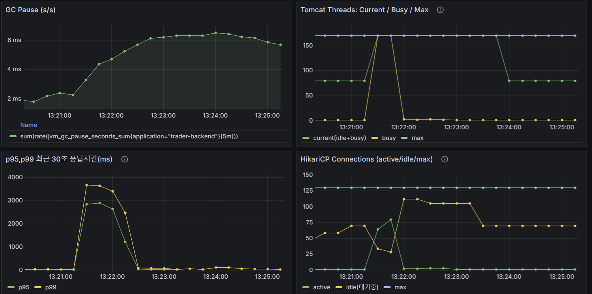
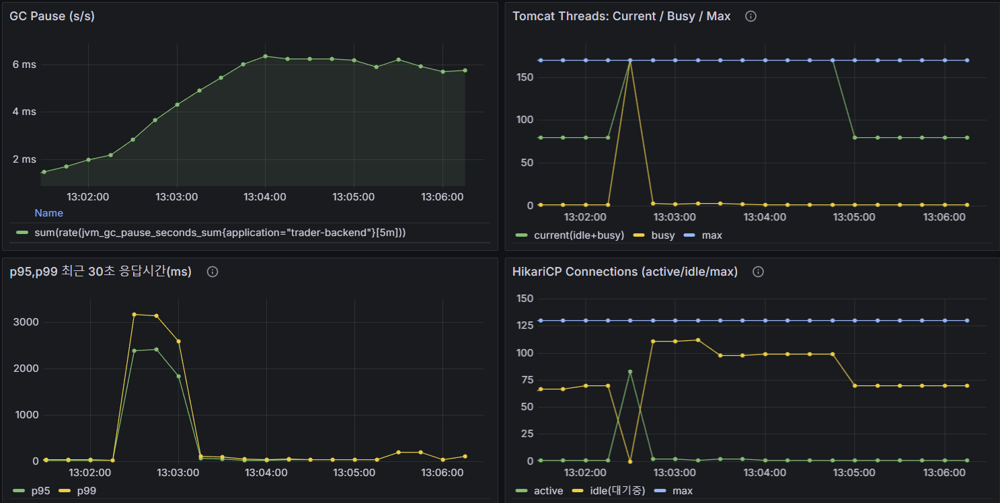
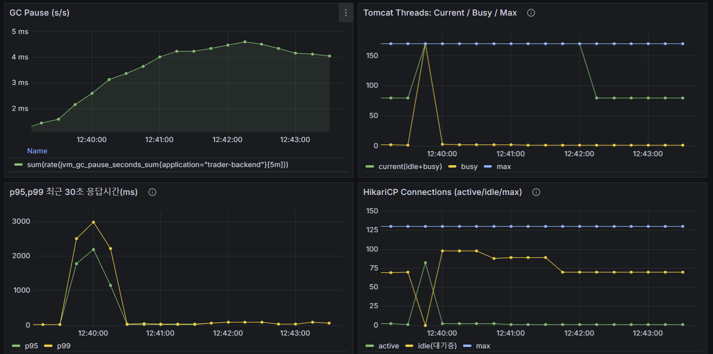
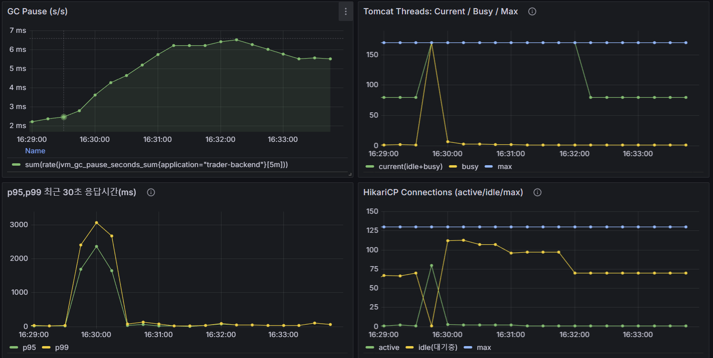

### NodeController 조회 성능 최적화: JPA Fetch 전략(Lazy, Batch, Fetch Join) 비교 및 캐시·메모리 영향 분석

## 📋 목차

- [1. 테스트 환경](#테스트-환경)
  - [1.1 성능저하 문제 확인](#성능저하-문제파악)
  - [1.2 테스트 결과-웜,콜드캐시](#테스트-결과)
- [2. JPA Fetch 전략 비교](#jpa-fetch-전략별-성능-비교)
  - [2.1 Postgres work_mem 설명 및 디스크 스필 확인](#비교-전-postgresql-work_mem-설명)
  - [2.2 Lazy Loading](#1️-lazy-loading)
  - [2.3 Fetch Join](#2️-fetch-join)
  - [2.4 Batch Fetch](#3️-batch-fetch-hibernatedefault_batch_fetch_size)
- [4. 종합 비교 및 결론](#종합-비교-요약)
- [5. 1차 결론](#1차-결론)
- [6. 2차 성능개선점 (목록조회)](#sec-2nd-optim)

  - [6.1 반환값 추가 요구사항](#반환값-추가-요구사항)
  - [6.2 행 폭증 제거](#1행-폭증-제거)
  - [6.3 부하테스트 결과(fetch join vs Native Query(Group By + JSON Aggregation)](#부하-테스트-결과노트까지-포함한-테스트)
  - [6.4 스키마, 노드 조회 구조 변경점 및 예상이점](#2-스키마-변경-및-서비스내의-노드-조회-구조-변경점)
  - [6.5.1 노드 컨텐츠 요약제공 테스트 결과(Explain)](#노드-컨텐츠-요약제공-explain-테스트-결과)
  - [6.5.2 노드 컨텐츠 요약제공 테스트 결과(K6 부하테스트)](#노드-컨텐츠-요약제공-부하-테스트-결과)

- `EndPoint:/api/nodes/{id}`

## 테스트 환경

| 항목                 | 설정                                                                                                       |
| -------------------- | ---------------------------------------------------------------------------------------------------------- |
| 서버 사양            | 4 Core / 16GB / SSD                                                                                        |
| DB                   | PostgreSQL 17 + TimescaleDB                                                                                |
| 커넥션 풀            | HikariCP max=150,idle=80                                                                                   |
| Redis                | max-active=128                                                                                             |
| 테스트 도구          | k6 v0.52                                                                                                   |
| 초기 부하 유형       | EdgeController와 비슷한 RPS를 상정하였을때 매우 큰 과부하 -> 요청량 >= 10000에 맞춰서 120RPS \* 90s로 진행 |
| 네트워크             | 내부 브릿지 (Docker Compose 환경)                                                                          |
| 고정 테스트 부하,RPS | 웜캐시로 진행 30RPS 2m -> 메인 테스트 120RPS 90s 시드값 777로 고정,메인 테스트만 포함하여 측정             |
| GC 지표 정의         | sum(rate(jvm_gc_pause_seconds_sum[5m]))                                                                    |
| JVM                  | OpenJDK Temurin 17 (64bit)                                                                                 |
| GC 종류              | G1GC (Garbage-First)                                                                                       |
| 힙 초기/최대 크기    | Xms=248MB / Xmx=3942MB (컨테이너 자동 설정)                                                                |
| Heap Region Size     | 2MB                                                                                                        |
| Parallel Workers     | 4                                                                                                          |
| Max Pause Target     | 200ms (기본값, G1 MaxGCPauseMillis)                                                                        |
| String Deduplication | **Disabled** (명시 옵션 미사용)                                                                            |

## 서론,요약

-

## 결정 로그

- 10/31: 1차 테스트 진행 후 -> fetch join으로 결정
- 11/02: 추가 튜닝 방법 고안
- 11/03: JSON 집계 시도 → 행 수 감소는 성공, p95↑(집계 CPU) → 보류
- 11/08: 20자 프리뷰로 JSON 크기 축소 → p95 개선은 있으나 Fetch Join 대비 여전히 열세
- 11/12: 링크 테이블에 note_subject 물리화 + 트리거 동기화 → 애플리케이션 변경 최소화로 확정

### 성능저하 문제파악

- 지난 엣지 컨트롤러 부하테스트에 비해 낮은 처리량 확인

- 기존 데이터의 경우 노드-링크매핑테이블(node_note_link)-노트 다대일 구조

- 초기 테스트 구조 노드 1대 링크매핑테이블 1로 테스트 진행 Lazy로딩만 사용하였다.

- 개선 방향이 필요해보였고 확실한 비교를 위해 노드와 연결된 노트의 개수를 10개로 늘려서 테스트 진행 -> 추후 서비스 운영시에 예상되는 노드1개당 최대 5개의 노트 사용량으로 예측되므로 10개의 노트링크를 5개로 줄여 안정값 테스트 진행예정이다.

## 테스트 결과

### 웜캐시 테스트

- 각 동일 조건, (APP,DB)컨테이너 내린 후 재시작, OS캐시 제거 후 3회 중에 중앙값으로 기록

| 항목                      | RPS | P95        | Throughput (active) |
| ------------------------- | --- | ---------- | ------------------- |
| Lazy단건(work_mem:8)      | 120 | 1348.48 ms | 127.23 req/s        |
| Lazy단건(work_mem:128)    | 120 | 1561.42 ms | 127.23 req/s        |
| Lazy목록(work_mem:8)      | 120 | 2551.14 ms | 125.01 req/s        |
| Lazy목록(work_mem:128)    | 120 | 2753.94 ms | 125.01 req/s        |
| 배치단건(work_mem:8)      | 120 | 1464.53 ms | 127.23 req/s        |
| 배치단건(work_mem:128)    | 120 | 1720.38 ms | 127.23 req/s        |
| 배치목록(work_mem:8)      | 120 | 1887.67 ms | 125.01 req/s        |
| 배치목록(work_mem:128)    | 120 | 2714.83 ms | 125.01 req/s        |
| FetchJoin단건(work_mem:8) | 120 | 874.27 ms  | 127.22 req/s        |
| FetchJoin목록(work_mem:8) | 120 | 412.91 ms  | 125.01 req/s        |

### 콜드캐시 테스트

- 각 동일 조건, (APP,DB)컨테이너 내린 후 재시작, OS캐시 제거 후 3회 중에 중앙값으로 기록

| 항목                      | RPS | P95        | Throughput (active) |
| ------------------------- | --- | ---------- | ------------------- |
| Lazy단건(work_mem:8)      | 40  | 3362.82 ms | 46.70 req/s         |
| Lazy목록(work_mem:8)      | 40  | 6643.57 ms | 46.67 req/s         |
| 배치단건(work_mem:8)      | 40  | 7516.25 ms | 46.67 req/s         |
| 배치목록(work_mem:8)      | 40  | 7246.47 ms | 46.67 req/s         |
| FetchJoin단건(work_mem:8) | 40  | 3149.68 ms | 46.70 req/s         |
| FetchJoin목록(work_mem:8) | 40  | 4871.70 ms | 46.70 req/s         |

## JPA Fetch 전략별 성능 비교

(테스트 환경: 동일 조건 / APP·DB 초기화 / OS 캐시 제거 후 3회 중앙값 기준)

### 비교 전 PostgreSQL work_mem 설명

- work_mem이란?

  - PostgreSQL에서 정렬(Sort), 해시(Hash Join, Hash Aggregate) 등을 수행할 때
    연산당 사용할 수 있는 메모리 한도를 지정하는 파라미터
  - 기본값은 수 MB(현재 서비스는 8MB) 수준이며, 작을수록 디스크 임시파일(temp spill)이 늘어나고 크면 RAM을 더 사용

- 이번 테스트에서 설정값

  - 해당 서비스에서 기본값 8MB -> 테스트를 위해 128MB로 진행
  - 주의점 : 해당 설정은 모든 병렬쿼리에서 전역적으로 사용되므로 128MB처럼 과도하게 사용시 OOM, 성능저하 발생
  - work_mem의 크기에 따른 성능을 보고자 테스트 환경에서만 임의적으로 사용

- 이번 테스트에서 효과가 거의 없었던 이유
  - JPA Fetch 전략에 따른 차이는 **쿼리 패턴 및 왕복 횟수** 차이이지,
    정렬 또는 해시 작업량 차이가 아니기 때문이다.
  - 따라서 work_mem을 8MB→128MB로 늘려도 쿼리 플랜이나 I/O 패턴이 변하지 않아
    p95 개선이 관찰되지 않았다.

<details>
<summary>📜 work_mem관련 디스크 스필 확인로그 (클릭하여 보기)</summary>

```sql
# work_mem 8에서 PostgreSQL이 쿼리 수행 중 임시 디스크(temp) 를 사용했는지 확인하는 쿼리
trader=# SELECT datname,
trader-# temp_files,
trader-# temp_bytes,
trader-# (temp_bytes/1024/1024)::numeric(10,2) AS temp_mb
trader-# FROM pg_stat_database
trader-# ORDER BY temp_bytes DESC
trader-# LIMIT 10;
datname | temp_files | temp_bytes | temp_mb
-----------+------------+------------+---------
postgres | 0 | 0 | 0.00
trader | 0 | 0 | 0.00
template1 | 0 | 0 | 0.00
template0 | 0 | 0 | 0.00
(5 rows)

# temp_files:DB 레벨에서 생성된 임시파일 개수 (work_mem 초과 시 발생)
# temp_bytes:생성된 임시파일의 총 크기 (바이트 단위)
# temp_mb:위를 MB로 환산한 계산 컬럼

trader=#
trader=# SELECT queryid, calls, temp_blks_read, temp_blks_written,
trader-# (temp_blks_written\*8/1024)::numeric(10,2) AS temp_mb,
trader-# query
trader-# FROM pg_stat_statements
trader-# WHERE temp_blks_written > 0
trader-# ORDER BY temp_blks_written DESC
trader-# LIMIT 10;
queryid | calls | temp_blks_read | temp_blks_written | temp_mb | query
---------+-------+----------------+-------------------+---------+-------
(0 rows)

# temp_blks_read:임시파일에서 읽은 블록 수
# temp_blks_written:임시파일에 쓴 블록 수 (work_mem 초과 시 기록됨)
# temp_mb:8KB 블록을 MB로 환산
# query:해당 SQL 쿼리
```

</details>

### 1️. Lazy Loading

| 구분      | 콜드캐시              | 웜캐시                 |
| --------- | --------------------- | ---------------------- |
| 단건 조회 | p95 **3362ms** @40RPS | p95 **1348ms** @120RPS |
| 목록 조회 | p95 **6643ms** @40RPS | p95 **2551ms** @120RPS |

#### 설명

엔티티를 지연로딩(Lazy)으로 가져올 때, 연관 엔티티 접근 시마다 추가 쿼리가 발생해 **N+1 문제**가 발생한다.
단건은 상대적으로 덜하지만, 목록의 경우 **왕복 쿼리 횟수가 기하급수적으로 증가**하여 DB I/O 병목이 생긴다.
work_mem 8→128로 변경 시 큰 차이가 없으며, 이는 병목이 정렬/해시가 아니라 **왕복 I/O**을 확인할 수 있다.

<details>
<summary>📜 Lazy목록 로그 결과 (클릭하여 보기)</summary>

```
# 쿼리 11번 노드 1번 + 링크 10번
Hibernate:
    /* select
        n
    from
        Node n
    where
        n.page.id = :pageId
    order by
        n.id  */ select
            n1_0.id,
            n1_0.content,
            n1_0.created_date,
            n1_0.modified_date,
            n1_0.page_id,
            n1_0.record_date,
            n1_0.subject,
            n1_0.symb,
            n1_0.x,
            n1_0.y
        from
            node n1_0
        where
            n1_0.page_id=?
        order by
            n1_0.id
Hibernate:
    select
        nl1_0.node_id,
        nl1_0.id,
        nl1_0.note_id
    from
        node_note_link nl1_0
    where
        nl1_0.node_id=?
Hibernate:
    select
        nl1_0.node_id,
        nl1_0.id,
        nl1_0.note_id
    from
        node_note_link nl1_0
    where
        nl1_0.node_id=?
Hibernate:
    select
        nl1_0.node_id,
        nl1_0.id,
        nl1_0.note_id
    from
        node_note_link nl1_0
    where
        nl1_0.node_id=?
Hibernate:
    select
        nl1_0.node_id,
        nl1_0.id,
        nl1_0.note_id
    from
        node_note_link nl1_0
    where
        nl1_0.node_id=?
Hibernate:
    select
        nl1_0.node_id,
        nl1_0.id,
        nl1_0.note_id
    from
        node_note_link nl1_0
    where
        nl1_0.node_id=?
Hibernate:
    select
        nl1_0.node_id,
        nl1_0.id,
        nl1_0.note_id
    from
        node_note_link nl1_0
    where
        nl1_0.node_id=?
Hibernate:
    select
        nl1_0.node_id,
        nl1_0.id,
        nl1_0.note_id
    from
        node_note_link nl1_0
    where
        nl1_0.node_id=?
Hibernate:
    select
        nl1_0.node_id,
        nl1_0.id,
        nl1_0.note_id
    from
        node_note_link nl1_0
    where
        nl1_0.node_id=?
Hibernate:
    select
        nl1_0.node_id,
        nl1_0.id,
        nl1_0.note_id
    from
        node_note_link nl1_0
    where
        nl1_0.node_id=?
Hibernate:
    select
        nl1_0.node_id,
        nl1_0.id,
        nl1_0.note_id
    from
        node_note_link nl1_0
    where
        nl1_0.node_id=?
```

</details>

#### 장점

- 코드 단순, 필요한 시점에 로딩 → 초기 부하 적음
- 작은 연관관계(1:1, 1:소량)에서는 유효

#### 단점

- N+1 쿼리로 인한 대규모 목록 처리 성능 저하
- 캐시 미스 시 I/O 부담 심함
- RPS 상승 시 커넥션/락 대기 증가

#### 권장 상황

- **단건 중심 API**
- **연관관계 접근이 거의 없는 목록** (DTO projection으로 최소화)

---

### 2️. Fetch Join

| 구분      | 콜드캐시              | 웜캐시                |
| --------- | --------------------- | --------------------- |
| 단건 조회 | p95 **3149ms** @40RPS | p95 **874ms** @120RPS |
| 목록 조회 | p95 **4872ms** @40RPS | p95 **413ms** @120RPS |

#### 설명

`fetch join`으로 필요한 연관 엔티티를 한 번의 쿼리로 가져오면 **왕복 횟수가 최소화**되어 레이턴시가 급감한다.
테스트 결과, 웜 상태에서 단건 조회는 목록 조회는 **874ms(p95)** 목록 조회는 **412ms(p95)** 로 Lazy의 약 **6배 이상 빠르다**.

<details>
<summary>📜 fetch목록 로그 결과 (클릭하여 보기)</summary>

```
#쿼리 1번
Hibernate:
    /* select
        distinct n
    from
        Node n
    left join

    fetch
        n.noteLinks l
    where
        n.page.id = :pageId
    order by
        n.id  */ select
            distinct n1_0.id,
            n1_0.content,
            n1_0.created_date,
            n1_0.modified_date,
            nl1_0.node_id,
            nl1_0.id,
            nl1_0.note_id,
            n1_0.page_id,
            n1_0.record_date,
            n1_0.subject,
            n1_0.symb,
            n1_0.x,
            n1_0.y
        from
            node n1_0
        left join
            node_note_link nl1_0
                on n1_0.id=nl1_0.node_id
        where
            n1_0.page_id=?
        order by
            n1_0.id
```

</details>

#### 장점

- 왕복 최소화 → **가장 낮은 p95**
- DB 캐시가 잡히면 매우 안정적이고 일관된 응답
- DTO projection과 병행 시 전송량 최소화 가능

#### 단점

- **한방 컬렉션 Fetch Join + 페이징 불가** (카르테시안/중복 문제)
  - Fetch Join 시 Page(Pageable)로 받기 제한적인 이유
  ```
  # 예를 들어 노드 A,B....Z가 있으며 각각 링크가 5개씩 있다고 한다면
  # 페이징으로 5개 만큼의 노드를 가지고 오고 싶을 때 보통 아래와 같은 쿼리로 조인한다.
  SELECT n
  FROM node n
  ORDER BY n.id
  LIMIT 5 OFFSET 0;
  # 하지만 페이징은 DB에서 행단위로 자르고 fetch join의 경우 연관된 링크까지 조인하여 중복된 행으로 펼쳐지게 된다.
  select *
  from node n
  left join node_note_link l on n.id = l.node_id
  order by n.id
  limit 5 offset 0;
  # (A,1),(A,2),(A,3),(A,4),(A,5),(B,1),(B,2),(B,3)...이런 구조로 펼쳐진다.
  # 따라서 기존의 의도는 노드 A,B,C,D,E와 연관된 링크를 가져오는 것이 아닌 LIMIT/OFFSET은 join 후 중복행에 적용되므로 노드 A의 5개 링크만 가져오게 되는 결과가 발생한다.
  ```
  - 해결방법 : 1.노드의 ID만 따로 페이징 -> 2. fetch join사용
  - MultipleBagFetchException문제
    - 현재 애플리케이션에는 없지만 만약 동시에 부모 1개에 2개 이상의 리스트 기반 컬렉션을 fetch join할 경우 **카르테시안 곱으로 인한 결과셋 폭증과 엔티티 매핑 혼란을 방지하기 위한 Hibernate의 보호 메커니즘**으로 예외를 발생시킨다.
    - [2단계 페이징,fetchJoin 관련링크](https://vladmihalcea.com/join-fetch-pagination-spring/?utm_source=chatgpt.com)
    - [MultipleBagFetchException 관련링크](https://thorben-janssen.com/hibernate-tips-how-to-avoid-hibernates-multiplebagfetchexception/?utm_source=chatgpt.com)
- 다중 fetch join 불가(하이버네이트 제약)
- 결과셋 폭증 위험 → 필요한 연관만 선택적으로

#### 권장 상황

- **읽기 중심 API**, 프론트 한 번의 호출로 완결되는 조회
- 목록은 `ID 페이지 → Fetch Join 2단계 조회` 패턴으로 안정화하기

```java
#실제 사용한 코드
#단건
@Query("""
select n.id
from Node n
where n.page.id = :pageId
order by n.id
""")
List<Long> findIdsByPageId(Long pageId, Pageable pageable);

@Query("""
select distinct n
from Node n
left join fetch n.noteLinks l
where n.id in :ids
order by n.id
""")
List<Node> findAllWithLinksByIds(Collection<Long> ids);
```

---

### 3️. Batch Fetch (`hibernate.default_batch_fetch_size`)

| 구분      | 콜드캐시              | 웜캐시                 |
| --------- | --------------------- | ---------------------- |
| 단건 조회 | p95 **7516ms** @40RPS | p95 **1465ms** @120RPS |
| 목록 조회 | p95 **7246ms** @40RPS | p95 **1888ms** @120RPS |

#### 설명

LazyLoading의 N+1 문제를 완화하기 위해 설정된 `default_batch_fetch_size`는
연관 엔티티를 **IN 쿼리(batch)** 로 묶어 한 번에 가져온다.
콜드에서는 효과 미미했지만, 웜캐시 목록에서 **2551→1888ms**로 개선되어 왕복 최소화 확인

<details>
<summary>📜 batch fetch목록 로그 결과 (클릭하여 보기)</summary>

```
#쿼리 2번 노드 + 링크배치
Hibernate:
    /* select
        n
    from
        Node n
    where
        n.page.id = :pageId
    order by
        n.id  */ select
            n1_0.id,
            n1_0.content,
            n1_0.created_date,
            n1_0.modified_date,
            n1_0.page_id,
            n1_0.record_date,
            n1_0.subject,
            n1_0.symb,
            n1_0.x,
            n1_0.y
        from
            node n1_0
        where
            n1_0.page_id=?
        order by
            n1_0.id
Hibernate:
    select
        nl1_0.node_id,
        nl1_0.id,
        nl1_0.note_id
    from
        node_note_link nl1_0
    where
        nl1_0.node_id = any (?)
```

</details>

#### 장점

- Lazy보다 **왕복 수 감소 → 성능 개선**
- **페이징과 완벽히 호환가능**
- 코드 수정 없이 설정만으로 적용 가능

#### 단점

- 콜드 I/O 상황에서는 Lazy와 큰 차이 없음
- 배치 사이즈 과다 시 IN 리스트 커져 플랜 비효율
- 완전한 1회 쿼리는 아니므로 fetch join보단 느림

#### 권장 상황

- **페이징 필수 + 연관 소량 접근**
- fetch join 폭발 위험이 있는 중간 복잡도 엔티티
- 일반적으로 64~256 수준 권장

```yaml
spring:
  jpa:
    properties:
      hibernate.default_batch_fetch_size: 16
```

---

## 종합 비교 요약

| 전략        | 왕복 쿼리 수 | 페이징 호환 | 성능(p95, 웜) | 권장 상황                 |
| ----------- | ------------ | ----------- | ------------- | ------------------------- |
| Lazy        | 많음 (N+1)   | 호환        | 1348~2551ms   | 단건 조회, 소규모         |
| Batch Fetch | 중간         | 호환        | 1465~1888ms   | 목록(페이징 필수)         |
| Fetch Join  | 최소 (1회)   | 제한        | **413~874ms** | 읽기 집중, 즉시 응답 필요 |

---

## 1차 결론

> 동일 환경에서 JPA의 세 가지 Fetch 전략을 비교한 결과,
> **Fetch Join이 왕복 최소화로 가장 낮은 p95를 기록(412ms @120RPS)** 하였으며,
> **Batch Fetch는 페이징과 호환되면서 Lazy 대비 평균 25% 성능 개선**을 보였다.
> 단순 메모리 확장(work_mem 조정)은 효과가 없었으며, **쿼리 구조·왕복 최소화가 핵심 병목 요인**임을 확인하였다.
> 본 실험을 통해 API별 특성에 따라 Fetch 전략을 구분 적용하는 것이 대규모 트래픽 환경에서 필수적임을 확인했다.

---

### 🔁 테스트 단계 전환 안내

#### 테스트 단계 전환(1차 → 2차)

- 1차 테스트에서는 UI 요구가 없었기 때문에 노트 링크의 noteId만 반환하여 왕복 쿼리 수 최소화 전략을 검증했다.
  해당 실험을 통해 쿼리 횟수가 적을수록 성능이 유의미하게 개선됨을 확인하였다.
- 2차 테스트부터는 UI 요구(노드 하단에 노트 제목 표시 및 클릭 로딩)에 따라 반환 스키마를 noteId → {id,title}로 확장한다.
  스키마 변경에 따른 페이로드 증가를 감안하여, 2차에서는 Fetch Join 대신 DTO 프로젝션/네이티브 집계를 채택해 로우 폭증 없이 필드만 추가하도록 설계했다.
- 1차 테스트와 마찬가지로 동일 원칙(왕복 최소화)을 유지한 2차 실험을 설계하였다.

### 스키마 변화 (요약)

- 1차 테스트

```
{
  "id": 101,
  "subject": "…",
  "noteIds": [11, 12, 15],
  ...
}
```

- 2차 테스트

```
{
  "id": 101,
  "subject": "…",
  "notes": [{"id":11,"title":"제목A"}, …],
  ...
}
```

<br><br><br>
<a id="sec-2nd-optim"></a>

# 2차-성능개선점(목록조회)

- **테스트 범위 조정 배경**

  - 단건 조회는 실제 서비스 내에서 사용되지 않는다.
  - 초기 페이지 렌더링 시, 페이지에 해당하는 모든 노드 목록을 한 번에 조회하여 프론트에 저장하고 이를 기반으로 화면을 구성한다.
  - 따라서 단건 조회는 실사용 시나리오에 포함되지 않으며, 목록 조회만이 실질적인 성능 지표가 된다.

- **1차 테스트 목적**

  - 1차 테스트에서는 Fetch 전략(Lazy, Batch, Fetch Join)의 특성을 공정하게 비교하기 위해 **단건 조회와 목록 조회를 모두 포함**하였다.
  - 이를 통해 Fetch 전략별로 쿼리 수, 행 폭증, 응답 지연의 차이를 명확히 분석하였다.

- **2차 테스트 방향 및 목표**
  - 실서비스 구조를 반영하여 **목록 조회만을 대상으로 성능 튜닝을 진행**한다.
  - 2차 튜닝 목표: **목록 조회 기준 300 RPS에서 p95 ≈ 300ms 달성**.

## 반환값 추가 요구사항

- 기존 noteId만을 반환하는 API에서 note의 제목을 같이 반환하고자 한다.
- 이를 위해 노트 테이블 또한 조회하여야 한다.

## 1.행 폭증 제거

- 1차 테스트의 목록 조회는 페이지당 10개의 노드를 불러오지만,  
  JPA Fetch Join 구조상 노드와 링크가 조인되면서 **DB 단에서 실제 조회 행이 약 100행으로 폭증**하였다.  
  (노드 10개 × 링크 10개)

- 이러한 행 폭증(Row Explosion)은 네트워크 전송량과 ORM 매핑 오버헤드를 동시에 유발하였다.  
  특히, Fetch Join은 컬렉션 조인 시 중복 데이터를 모두 읽은 뒤 애플리케이션 단에서 병합하므로  
  쿼리 효율이 떨어지는 문제가 있었다.

- 따라서 **2차 테스트에서는 Fetch Join 대신 Native Query(Group By + JSON Aggregation)** 를 사용하여  
  행 폭증을 최소화하고, 한 번의 쿼리로 노드-노트 링크 정보를 JSON 형태로 묶어 반환하도록 변경하였다.

- 아래는 psql로 행 폭증 감소 테스트를 진행한 결과다

<details>
<summary>📜 psql 로그 결과 (클릭하여 보기)</summary>

- Before: Node × Link = 10 × 10 = 100 rows

- 노드당 10개의 행으로 폭증된다

```sql
trader=# SELECT
trader-#   n.id AS node_id,
trader-#   n.subject AS node_subject,
trader-#   l.id AS link_id,
trader-#   l.note_id AS note_id,
trader-#   no.subject AS note_title
trader-# FROM node n
trader-# LEFT JOIN node_note_link l ON l.node_id = n.id
trader-# LEFT JOIN note no ON no.id = l.note_id
trader-# WHERE n.page_id = 200125
trader-# ORDER BY n.id, l.note_id;
 node_id |   node_subject    | link_id | note_id | note_title
---------+-------------------+---------+---------+------------
      43 | subject_200125_1  | 2000401 |      29 | 안뇽하세요
      43 | subject_200125_1  | 2000402 |      30 | 123
      43 | subject_200125_1  | 2000403 |      31 | string
      43 | subject_200125_1  | 2000404 |      32 | string
      43 | subject_200125_1  | 2000405 |      33 | TEST
      43 | subject_200125_1  | 2000406 |      34 | asd
      43 | subject_200125_1  | 2000407 |      35 | 123
      43 | subject_200125_1  | 2000408 |      36 | 123
      43 | subject_200125_1  | 2000409 |      37 | DDC
      43 | subject_200125_1  | 2000410 |      38 | note_138

...
```

- After: Grouped by Node → 10 rows (notes aggregated as JSON array)

- 예상대로 10개의 노트id와 노트 제목이 한 행 JSON형식으로 나온다

```sql
trader=# SELECT
trader-#   n.id,
trader-#   n.x, n.y, n.subject, n.page_id,
trader-#   COALESCE(
trader(#     json_agg(json_build_object('id', l.note_id, 'title', no.subject)
trader(#              ORDER BY l.note_id)
trader(#       FILTER (WHERE l.note_id IS NOT NULL),
trader(#     '[]'::json
trader(#   ) AS notesJson
trader-# FROM node n
trader-# LEFT JOIN node_note_link l ON l.node_id = n.id
trader-# LEFT JOIN note no ON no.id = l.note_id
trader-# WHERE n.page_id = 200125
trader-# GROUP BY n.id, n.x, n.y, n.subject, n.page_id
trader-# ORDER BY n.id;
   id    |    x    |    y    |      subject      | page_id |                                                                                                                                                            notesjson
---------+---------+---------+-------------------+---------+---------------------------------------------------------------------------------------------------------------------------------------------------------------------------------------------------------------------------------------------------------------------------------------------------------------------------------
      43 |   457.3 | -226.57 | subject_200125_1  |  200125 | [{"id" : 29, "title" : "안뇽하세요"}, {"id" : 30, "title" : "123"}, {"id" : 31, "title" : "string"}, {"id" : 32, "title" : "string"}, {"id" : 33, "title" : "TEST"}, {"id" : 34, "title" : "asd"}, {"id" : 35, "title" : "123"}, {"id" : 36, "title" : "123"}, {"id" : 37, "title" : "DDC"}, {"id" : 38, "title" : "note_138"}]
  200043 ....
```

</details>

<details>
<summary>📜 psql 로그 결과-행 수만 조회 (클릭하여 보기)</summary>

- 10개의 노드에 대해서 각 100개 10개, 결과 행의 수가 10분의 1로 줄어들어 행 폭증이 사라진 모습이다.
- Before: Node × Link = 10 × 10 = 100 rows

```sql
trader=# SELECT COUNT(*) AS row_count_before
trader-# FROM node n
trader-# LEFT JOIN node_note_link l ON l.node_id = n.id
trader-# LEFT JOIN note no ON no.id = l.note_id
trader-# WHERE n.page_id = 200125;
 row_count_before
------------------
              100
(1개 행)
```

- After: Grouped by Node → 10 rows (notes aggregated as JSON array)

```sql
SELECT COUNT(*) AS row_count_after
FROM (
  SELECT n.id
  FROM node n
  LEFT JOIN node_note_link l ON l.node_id = n.id
  LEFT JOIN note no ON no.id = l.note_id
  WHERE n.page_id = 200125
  GROUP BY n.id
) t;

row_count_after
---
              10

(1개 행)

```

</details>

- 결과적으로, json_agg와 GROUP BY를 이용하여  
  10배에 달하던 행 폭증이 제거

### 2차 부하 테스트 결과(노트까지 포함한 테스트)

> ① **1차 = Fetch Join (행 폭증 발생)**: Node×Link 조인으로 결과 행 수 증가(중복 병합은 애플리케이션에서 처리)  
> ② **2차 = JSON 집계 (행 폭증 미발생)**: DB에서 `json_agg`로 그룹화·집계하여 행 수 축소(집계 CPU 비용↑)

| 구분                              | 시나리오 | P95 (ms) | Throughput(active) | Fail Rate |
| --------------------------------- | -------- | -------- | ------------------ | --------- |
| **1차=Fetch Join(행 폭증 발생)**  | Case 1   | 4344.17  | 124.99             | 0.00%     |
|                                   | Case 2   | 2572.21  | 125.00             | 0.00%     |
|                                   | Case 3   | 2783.97  | 125.00             | 0.00%     |
| **2차=JSON 집계(행 폭증 미발생)** | Case 1   | 5212.05  | 123.62             | 0.00%     |
|                                   | Case 2   | 5355.46  | 124.83             | 0.00%     |
|                                   | Case 3   | 3961.93  | 125.01             | 0.00%     |

**해석 요약**

- ②는 **행 수는 줄었지만** `json_agg`/정렬(ORDER BY)/그룹화 비용이 커서 p95가 더 높게 측정됨.
- ①은 행 폭증으로 네트워크/매핑 오버헤드는 있지만, **조인 자체의 CPU 비용이 상대적으로 낮아** 케이스에 따라 p95가 더 낮게 나옴.

- 따라서 3차 설계에서는 노트 본문을 집계하지 않고 링크 테이블만 반환하도록 구조를 단순화하였다.

- 단 기존의 노드목록조회에 노트ID와 제목이 필요하다는 점을 고려하여 링크 테이블의 스키마를 추가할 예정이다.

## 2. 스키마 변경 및 서비스내의 노드 조회 구조 변경점

- 기존에는 노드 목록 조회로 모든 데이터를 선조회 후 개별조회 기능은 사용하지 않았다.
- 하지만 NativeQuery의 성능이 예상과 다르게 좋지 않고 fetch join또한 3개의 테이블을 조인해야 하기에 링크 테이블 스키마에 연결된 노트 제목을 추가하는 방향으로 가고자 한다.

```sql
#스키마 변경
ALTER TABLE node_note_link
ADD COLUMN note_subject VARCHAR(255);
#기존 데이터 복사
UPDATE node_note_link l
SET note_subject = n.subject
FROM note n
WHERE n.id = l.note_id;
#조회 예시
trader=# SELECT id, node_id, note_id, note_subject
trader-# FROM node_note_link
trader-# LIMIT 10;
  id   | node_id | note_id | note_subject
-------+---------+---------+--------------
 30129 | 1280185 |   15090 | note_21790
 30142 | 1410185 |   15063 | note_21763
 30147 | 1460185 |   15131 | note_21831
 30151 | 1500185 |   15089 | note_21789
 30160 | 1590185 |   15053 | note_21753
 30161 | 1600185 |   15038 | note_21738
 30181 | 1800185 |   15109 | note_21809
 30187 | 1860185 |   15132 | note_21832
 30213 |  120186 |   15203 | note_21903
 30221 |  200186 |   15191 | note_21891
(10 rows)

#노트 제목 변경시 자동 동기화 트리거, 해당 트리거로 애플리케이션 레벨 로직 수정X
#CASCADE로 노드,노트 삭제시에 링크도 삭제되기 때문에 insert, delete 는 제외
CREATE OR REPLACE FUNCTION trg_sync_note_subject()
RETURNS trigger AS $$
BEGIN
  UPDATE node_note_link
  SET note_subject = NEW.subject
  WHERE note_id = NEW.id;
  RETURN NEW;
END;
$$ LANGUAGE plpgsql;

CREATE TRIGGER sync_note_subject_after_update
AFTER UPDATE OF subject ON note
FOR EACH ROW
EXECUTE FUNCTION trg_sync_note_subject();


#노트 제목 변경 및 결과
trader=# UPDATE note
trader-# SET subject = 'updated_note_subject'
trader-# WHERE id = 15090;

trader=# SELECT id, node_id, note_id, note_subject
FROM node_note_link where note_id='15090';
  id   | node_id | note_id |     note_subject
-------+---------+---------+----------------------
 30029 |  280185 |   15090 | updated_note_subject
 30129 | 1280185 |   15090 | updated_note_subject
(2 rows)


```

### 스키마 변경안

- 기존 : 노드*노트*링크 테이블
  - 필드 : id, node_id, note_id
- 수정 : 노드*노트*링크 테이블
  - 필드 : id, node_id, note_id , note_subject

## 테스트 결과

1. `NativeQuery + JSON Aggregation`를 사용하여 node, node_note_link, note테이블 조회(기존 스키마에서 JSON Aggregation사용)
   <details>
   <summary>📜 코드보기 (클릭하여 보기)</summary>

   ```java
   @Query(value = """
          select
                n.id,
                n.x,
                n.y,
                n.subject,
                n.content,
                n.symb,
                n.record_date,
                n.page_id,
                n.created_date,
                n.modified_date,
                coalesce(
                  jsonb_object_agg(l.note_id, no.subject)
                    filter (where l.note_id is not null),
                  '{}'::jsonb
                ) as notes_json
              from node n
              left join node_note_link l on l.node_id = n.id
              left join note no on no.id = l.note_id
              where n.page_id = :pageId
              group by n.id, n.x, n.y, n.subject, n.content, n.symb,
                       n.record_date, n.page_id, n.created_date, n.modified_date
              order by n.id
        """, nativeQuery = true)
    List<NodeRowProjection> findAllNodeRowProjectionByPageId(@Param("pageId") Long pageId);
   ```

   </details>

2. node_note_link 테이블에 noteSubject를 포함해 `프로젝션`으로 조회(노트 컨텐츠 500자 조회, 수정된 스키마 사용)
   <details>
   <summary>📜 코드보기 (클릭하여 보기)</summary>

   ```java
   @Query("""
      select
          n.id                as id,
          n.x                 as x,
          n.y                 as y,
          n.subject           as subject,
          n.content           as contentPreview,
          n.page.id           as pageId,
          n.createdDate       as createdDate,
          n.modifiedDate      as modifiedDate,
          l.note.id           as noteId,
          no.subject          as noteSubject
      from Node n
      left join n.noteLinks l
      left join l.note no
      where n.page.id = :pageId
      order by n.id
    """)
    List<NodePreviewWithNoteProjection> findAllWithNotesByPageId(Long pageId);
   ```

   </details>

3. node_note_link 테이블에 noteSubject를 포함해 `프로젝션`으로 조회(노트 컨텐츠 20자로 줄여서 조회, 수정된 스키마 사용)
   <details>
   <summary>📜 코드보기 (클릭하여 보기)</summary>

   ```java
   @Query("""
          select
              n.id                as id,
              n.x                 as x,
              n.y                 as y,
              n.subject           as subject,
              substring(n.content, 1, 20) as contentPreview,
              n.symb              as symb,
              n.recordDate        as recordDate,
              n.page.id           as pageId,
              n.createdDate       as createdDate,
              n.modifiedDate      as modifiedDate,
              l.note.id           as noteId,
              no.subject          as noteSubject
          from Node n
          left join n.noteLinks l
          left join l.note no
          where n.page.id = :pageId
          order by n.id
        """)
    List<NodePreviewWithNoteProjection> findAllPreviewWithNotesByPageId(Long pageId);
   ```

   </details>

4. node_note_link 테이블에 noteSubject를 포함해 `fetch Join`으로 조회(노트 컨텐츠 500자 조회, 수정된 스키마 사용)
   <details>
   <summary>📜 코드보기 (클릭하여 보기)</summary>

   ```java
   @Query("""
   select distinct n
   from Node n
   left join fetch n.noteLinks l
   where n.page.id = :pageId
   order by n.id
   """)
   List<Node> findAllFetchByPageId(@Param("pageId") Long pageId);
   ```

   </details>

### DB EXPLAIN 결과 평균 (콜드 vs 웜 캐시, fetch join은 제외)

| 구분           | 캐시 상태 | 평균 Planning Time (ms) | 평균 Execution Time (ms) |
| -------------- | --------- | ----------------------- | ------------------------ |
| **JSON 조인**  | 콜드      | **51.14**               | **14.08**                |
| **JSON 조인**  | 웜        | **2.53**                | **1.32**                 |
| **500자 조회** | 콜드      | **41.26**               | **12.03**                |
| **500자 조회** | 웜        | **2.75**                | **0.91**                 |
| **20자 조회**  | 콜드      | **41.57**               | **12.26**                |
| **20자 조회**  | 웜        | **2.38**                | **1.34**                 |

---

**요약**

- JSON 조인은 콜드 상태에서 **플래닝 타임 약 10ms 더 높음** -> 조인/집계 구조 영향 확인.
- 웜 캐시 이후에는 세 쿼리 모두 **Planning 2~3ms**, **Execution 1ms대**로 수렴.
- 20자·500자 간 실행 시간 차이는 **미미(±0.2ms)** — `substring` 길이보단 조인 구조가 영향 요인. |

---

### 3차 K6 부하테스트 결과 평균 (콜드 vs 웜 캐시)

- 초기 캐시를 위해 30RPS 40초 진행 -> 본 부하 120RPS 90s진행

| 구분                                                         | RPS    | P95(ms)                     | 평균 처리량(req/s, 3회 평균) | 실패율 |
| ------------------------------------------------------------ | ------ | --------------------------- | ---------------------------- | ------ |
| **500자 3단계 테이블 조회 (NativeQuery + JSON Aggregation)** | 30→120 | 3956.36 → 3121.20 → 3615.47 | **50.91**                    | 0.00%  |
| **500자 2단계 테이블 조회 프로젝션**                         | 30→120 | 2126.32 → 3387.88 → 2656.24 | **50.83**                    | 0.00%  |
| **20자 2단계 테이블 조회 프로젝션**                          | 30→120 | 1345.88 → 2119.68 → 1450.58 | **50.90**                    | 0.00%  |
| **500자 2단계 테이블 조회 Fetch Join**                       | 30→120 | 1100.02 → 1489.86 → 924.54  | **50.91**                    | 0.00%  |

---

### 500자 기준 모니터링 성능 그래프

1. 500자 3단계 페이지 조회 `NativeQuery + JSON Aggregation`



2. 500자 2단계 조회 `프로젝션`

 3. 500자 2단계 테이블 조회 `Fetch Join`

3. 500자 2단계 조회 `fetch join`



4. +20자 2단계 조회 `프로젝션`



#### 500자 콘텐츠 반환 모니터링 + k6부하테스트 분석 요약

| 구분                                           | GC Pause (s/s)       | p95/p99 응답시간(ms)    | Thread / Connection 사용량              | 평균 처리량(req/s) |
| ---------------------------------------------- | -------------------- | ----------------------- | --------------------------------------- | ------------------ |
| **3단계 JSON Aggregation (Native + json_agg)** | **6ms 이상 유지**    | 피크 3956 → 3121 → 3615 | Busy Thread 폭 넓음 / Active 40~50 유지 | **50.91**          |
| **2단계 Projection (JPQL DTO)**                | **6ms 피크 후 급락** | 피크 2126 → 3387 → 2656 | Busy Thread 짧고 빠른 복귀              | **50.83**          |
| **2단계 Fetch Join**                           | **4~5ms 유지**       | 피크 1100 → 1489 → 924  | Busy Thread 안정 / Active <10           | **50.91**          |

## 1. GC , 메모리 관점

> ※ JVM 기본 G1GC 환경(Heap Max 3.9GB, Region 2MB, MaxGCPauseMillis≈200 기준)에서
> 모든 테스트를 수행하였으며, GC 설정은 기본값으로 유지하였다.

- **JSON Aggregation (3-Table, jsonb_object_agg)**

  - DB·JVM 양쪽에서 **문자열 기반 직렬화/역직렬화**가 대량 발생 → **임시 객체 폭증** → **GC Pause 누적**.
  - STW 구간이 길어지고 **Tomcat Busy 폭이 넓게** 유지됨.

- **Projection (2-Table, DTO)**

  - 직렬화 없이 **ResultSet → DTO 매핑**만 수행.
  - 다만 **조인으로 인한 행 폭증 = DTO 개수 폭증**으로 **Eden 포화 → GC 발생**.
  - Pause 자체는 짧고 **안정화가 빠름**.

- **Fetch Join (2-Table, 엔티티 그래프)**

  - DB 결과는 Projection과 동일하게 **행 폭증**이지만,
  - 하이버네이트가 **1차 캐시로 부모 엔티티를 Dedup**(ID 기준) → **부모 10개 + 링크 100개** 형태로 물질화.
  - **큰 본문(content)** 은 부모당 1회만 할당되어 **중복 문자열 생성이 없음** → **STW 영향 최소**.

> **왜 이번 테스트에선 Fetch Join의 GC Pause가 더 낮았나?**
> Projection은 **행 수만큼 DTO + 문자열(500자)** 이 반복 생성되어 **총 객체 수가 더 많고**,
> Fetch Join은 **부모 Dedup + 컬렉션 누적**으로 **힙 객체 수가 줄었기 때문.**

### 500자 vs 20자 (Projection)

- **GC Pause는 거의 동일** → GC 부하는 **문자열 길이보다 “객체 개수(행 폭증)”**에 좌우됨.
- 차이는 **p95 응답시간**에서 나타남 → 본문을 줄이면 **JSON 변환 비용**(네이티브/응답 직렬화)이 줄어들어 응답 분포가 개선.

> **Stop-the-World(STW)**: GC 실행 시 JVM이 애플리케이션 스레드를 **일시 정지**하는 구간.
> STW가 길수록 p95/p99 스파이크, Busy thread 확대, 커넥션 반환 지연이 발생.

---

## 2. Thread , Connection 부하

- **JSON Aggregation**: Busy Thread **160+** 유지, Active 커넥션 **50+** 점유.
  직렬화/파싱이 **CPU bound**라 스레드 반환이 늦음.
- **Projection / Fetch Join**: Busy 폭 **짧고 빠른 복귀**, Active **10~15** 내외로 안정.

---

## 3. 응답시간 (p95/p99)

- **JSON Aggregation**: **3~4초 피크가 2회**, STW 이후 **backlog 해소가 길다**.
- **Projection**: **단일 피크 후 1~2초 내 복귀**, 분포 안정.
- **Fetch Join**: **p95 ≈ 1s** 수준, **Throughput/분산 가장 균일**.

---

## 결론

- **행 폭증이 있는 조회라면** GC 관점에서
  **Fetch Join(부모 Dedup + 컬렉션 누적) ≤ Projection(DTO 폭증) ≪ JSON Aggregation(직렬화/파싱 폭증)**
  순으로 유리했다.
- **JSON 집계**는 행 수는 줄이나 집계/정렬/직렬화 비용으로 인해 **CPU 바운드 + GC 압력이 커져** p95가 높아졌다.
- **본문 길이 축소(500→20자)** 는 **GC Pause에는 미미**, **JSON 변환 비용(p95)** 에서 체감 개선.
- 동일 RPS에서 **왕복 최소화 + 객체 수 최소화**가 **핵심 병목 해소 전략**임을 확인했다.

---

### 테스트와 분석을 통한 조회 전략 선택 가이드

| 상황                             | 권장 전략                                              | 이유/주의                                            |
| -------------------------------- | ------------------------------------------------------ | ---------------------------------------------------- |
| 페이징 필수, 연관 소량           | **Batch Fetch** (`hibernate.default_batch_fetch_size`) | N+1 완화 + 페이징 호환, 왕복 적당                    |
| 한 번에 화면 완결, 페이징 불필요 | **Fetch Join + 2단계(ID→fetch)**                       | 왕복 최소화(p95 유리), 컬렉션 페이징은 분리          |
| 행 폭증 매우 큼, CPU 여유        | **JSON Aggregation**                                   | 네트워크/행 수 감소, 대신 집계/정렬 CPU 및 GC 압력 ↑ |
| 대용량 본문 포함                 | **Projection(프리뷰 20자) + 상세 개별 조회**           | 응답 JSON 축소로 p95 안정                            |
| p95·GC 민감                      | **Fetch Join(부모 Dedup 유리)**                        | 객체 수/중복 감소로 STW 영향 최소화                  |
